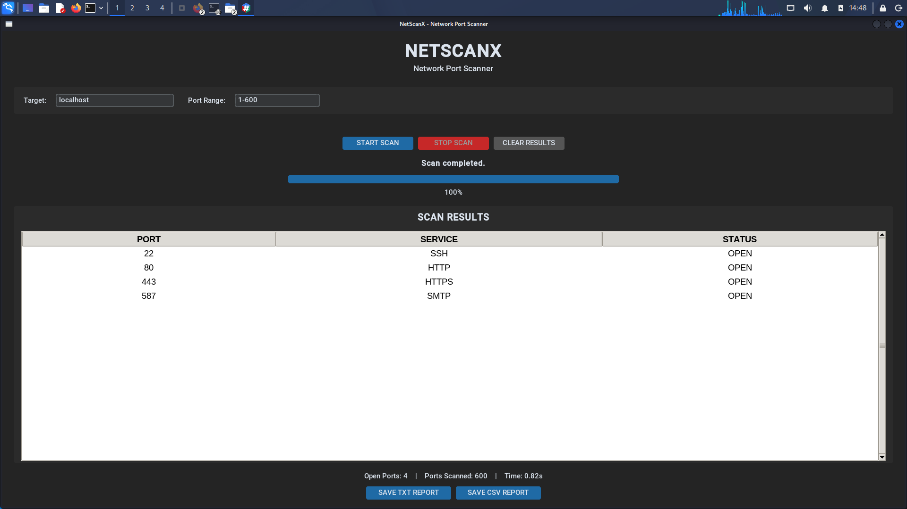
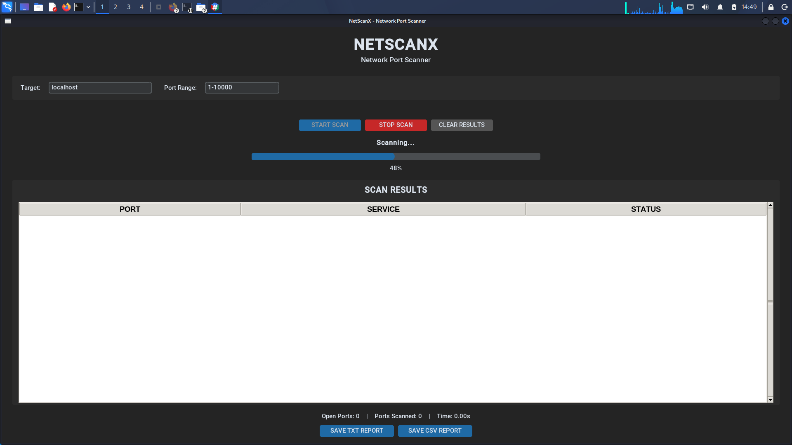
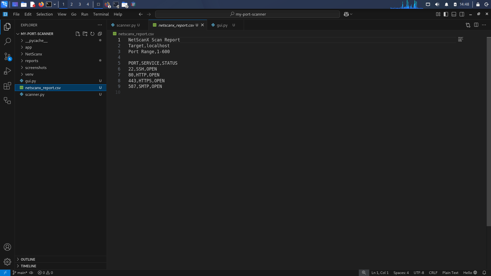

# NETSCANX---Port-Scanner
NetScanX is a Python-based TCP network port scanner developed as a cybersecurity learning project.
The application allows users to scan a target IP address or hostname within a selected TCP port range and identify open ports and their associated services.

NetScanX provides both a graphical user interface and a modular scanning engine.

---

## 📸 Project Preview

> Add your GUI screenshots here.

### Main Interface




### Progress




### Scan Results




---

## 🚀 Features

- TCP port scanning
- IP address and hostname support
- Port range validation
- TCP service identification
- Multi-threaded scanning
- Real-time scanning progress
- Scan percentage display
- Stop Scan functionality
- Clear Results functionality
- Open-port results table
- Scan statistics
- TXT report generation
- CSV report generation
- Graphical user interface
- Command-line scanner support
- Error handling and input validation

---

## 🛠️ Technologies Used

- Python 3
- CustomTkinter
- TCP/IP
- Python Socket Programming
- ThreadPoolExecutor
- Multithreading
- CSV
- Linux / Kali Linux

---

## 📂 Project Structure

```text
my-port-scanner/
│
├── scanner.py
├── gui.py
├── requirements.txt
├── README.md
├── .gitignore
│
├── screenshots/
│   ├── main_gui.png
│   ├── scanning.png
│   └── results.png
│
└── reports/
    └── .gitkeep
